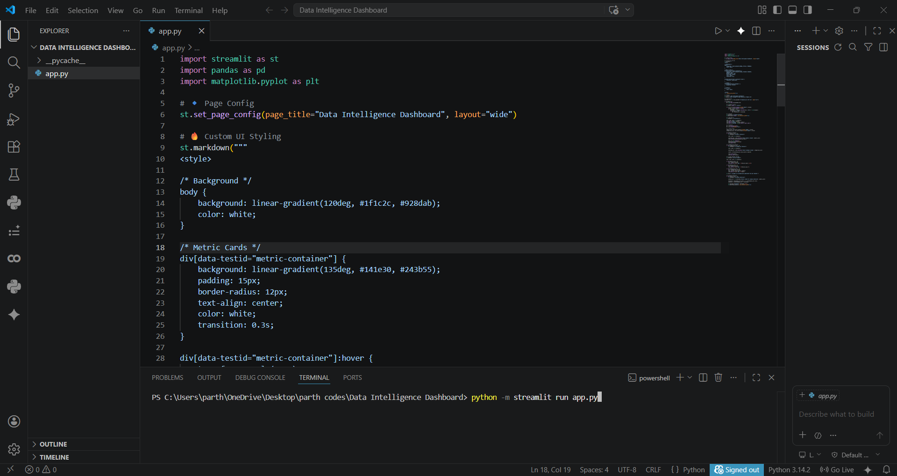
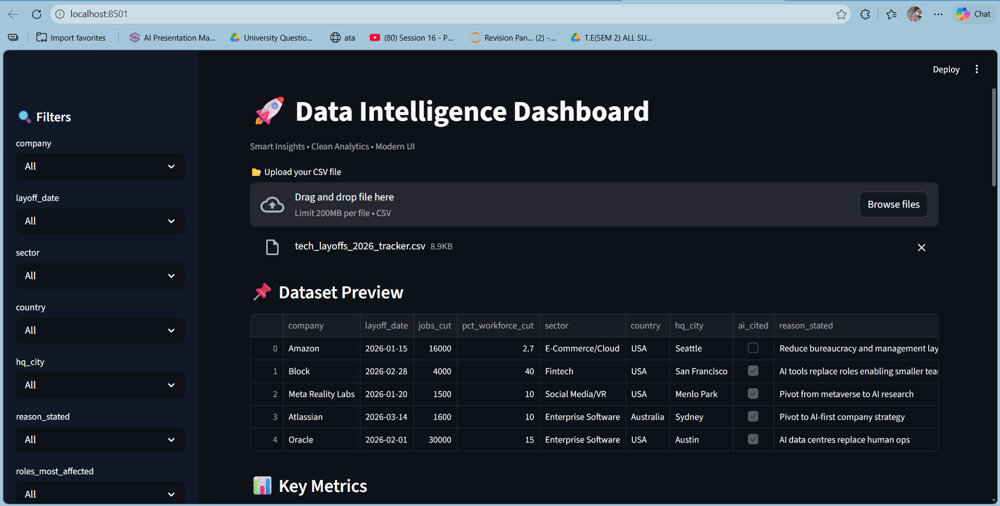
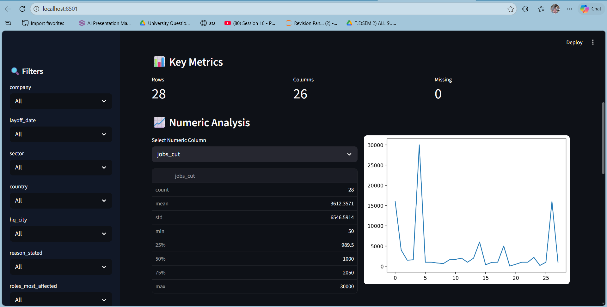

# Data Intelligence Dashboard

> Transform raw data into actionable insights instantly.

---

## Overview
A modern, dataset-agnostic analytics dashboard that automatically analyzes CSV files,
generates key insights, and detects anomalies.

---

## Features
- Works with any dataset
- Automated insight generation
- Anomaly detection
- Interactive visualizations
- Clean UI

---

## Tech Stack
- Python
- Pandas
- Streamlit
- Matplotlib

---

## Screenshots

### Dashboard


### Insights


### Charts


---

## How to Run

```bash
pip install -r requirements.txt
streamlit run app.py
